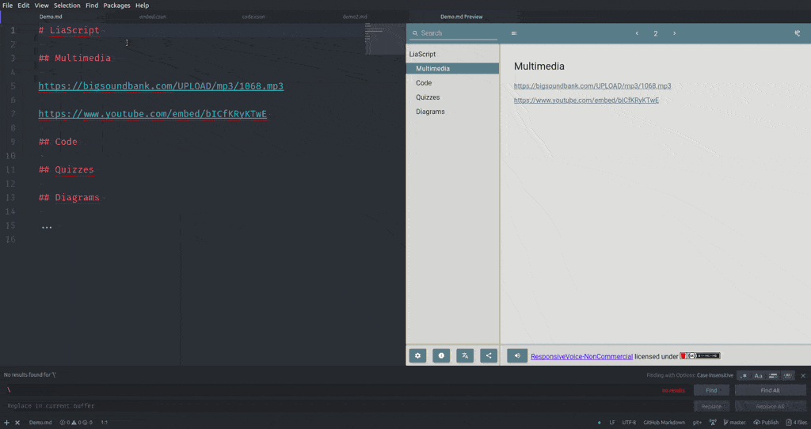

# LiaScript-Snippets

A snippet-plugin for [Atom](https://Atom.io) and [VSCode](https://code.visualstudio.com), easing the development of online courses with
[LiaScript](https://LiaScript.github.io), and extended Markdown notation.

https://atom.io/packages/liascript-snippets

## Install

Simply to to the marketplace in [Atom](https://Atom.io) and [VSCode](https://code.visualstudio.com/) and search for "liascript-snippets".

### Atom
#### Command Line

Install Atom 1.5 or newer

In the terminal, install the package via apm:

    `apm install liascript-snippets`

#### GUI

1. Install Atom 1.5 or newer
2. Launch Atom
3. Open Settings View using Cmd+, on macOS or Ctrl+, on other platforms
4. Click the Install tab on the left side
5. Enter `liascript-snippets` in the search box and press Enter
6. Click the "Install" button that appears

## Features

1. Start typing **lia** in your markdown document to see the extended help, that
   can be explored via fuzzy-searching. Hit Tab for inserting your selected
   snippet.
2. To ease the voice selection for different narrators, start typing **voice**
   and search through all possible voice settings.
3. Syntax highlighting help is offered if you start typing **hili** followed by
   your language of choice. Since LiaScript applies the ace-editor, there is a
   matching done between highlight.js and ace. You can select your language from
   highlight.js, but it will be translated into the text in parentheses.

**Screencast Lisascript-snippets and -preview**

<!--width= "100%" -->

## Related Projects

It is recommended to install also:

liascript-preview

* for [Atom](https://atom.io/packages/liascript-preview)
* for VSCode

A previewer plugin that renders your course directly within the Atom IDE or which starts the development server from VSCode.

## Recommended Projects

Since unicode is supported, you can also use any kind of Emoji, so installing
the following project is recommended...

https://atom.io/packages/autocomplete-emojis
